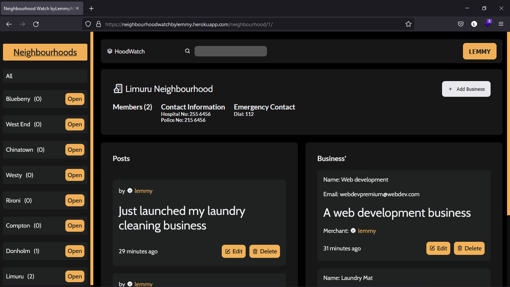

# Neighbourhood_Watch
A web application that allows you to be in the loop about everything happening in your neighborhood. From contact information of different handyman to meeting announcements or even alerts.. etc

## Table of contents
  - [Screenshot](#screenshot)
  - [Project Visual](#Screenshot)
  - [Project Description](#Project-description) 
  - [Built with](#built-with)
  - [Usage](#Getting-Started)
  - [License & Copywright Information](#License-and-Copywright-Information)
  - [Author](#author)

---
___

### Screenshot

___
---
### Introduction
Neighbourhood_Watch
A web application that allows you to be in the loop about everything happening in your neighborhood. From contact information of different handyman to meeting announcements or even alerts.. etc. Performs user authentication, stores user data in a database and Images are stored in a CDN.

Project is written with django 4.0.3 and python 3 in mind.

---
___

### BDD
 #### Context
  Given that a user creates an account.
 #### Event
  When the user logs in or interacts with the page
#### Outcomes
  Then a user should be prompted to edit their profile and pick their neighbourhood\
  The user should also be able to post updates/events/meetings to their neigbourhood.\
  The user should also be able to submit their businesses to their neighbourhood\
  Each submition should be queried from the most up to date.\
  The user should also be able to interact with other neighbourhoods.\
  When the user tries to query the data using the search form(from an Project's details e.g title or a user's name) only relevant posts that much the specific query should be displayed.

* [x] A user can create an account and login.
* [x] Users can add their neighbourhood and also update it incase they decide to move out.
* [x] Users can submit their own businesses to their neighbourhood.
* [x] Each user can view/interact with other neighbourhoods.
* [x] Each user has a user profile.
* [x] Each profile filters that specific user's details.
* [x] Data can be queried using the search feature.

---
___
### Built with / Technologies Used

- Python
    - Django
    - PostgresSQL
    - Cloudinary
---
___

# Getting Started

First clone the repository from Github and switch to the new directory:

    $ git clone git@github.com:LemmyMwaura/Neighbourhood_Watch.git
    $ cd Neighbourhood_Watch
    
Activate the virtual environment for the project.

     $ pipenv shell
    
Install project dependencies:

    $ pipenv install
    
    
Then simply apply the migrations:

    $ python manage.py migrate
    

You can now run the development server:

    $ python manage.py runserver

 

---
___

## License and Copywright Information
(c) Stephen Lemmy Mwaura, Software Engineer.

Licensed under the [MIT License](LISENCE)

---
___
## Author 
Hi there, I'm Lemmy and i love to code. Connect With me:

- 🎱 Github - [@lemmyMwaura](https://github.com/LemmyMwaura)

---
___

